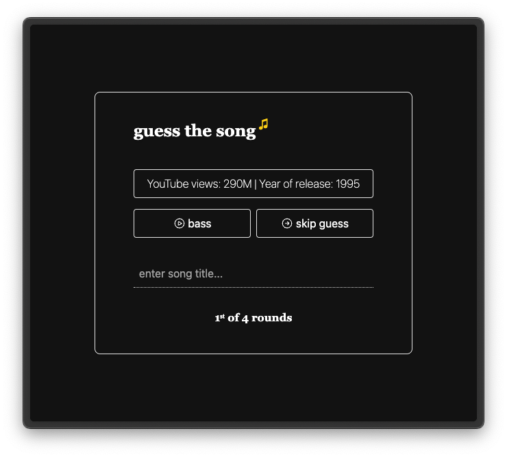

# Was laeuft

  
[Live](https://was-laeuft.pages.dev/)

Guess the song based on the individual instrument tracks.
Inspired by [bandle.app](https://bandle.app/).

WIP

## TODOS

- [ ] custom error page
- [ ] animations & micro animations
- [ ] navigate between songs
- [ ] refactor quiz state logic
- [ ] optimize play/pause/stop logic
- [ ] implement scoring system
- [ ] consolidate [id].vue & index.vue
- [ ] fix: `You have provided functional plugins in tailwindcss.config in your Nuxt configuration that cannot be serialized for Tailwind Config. Please use tailwind.config or a separate file (specifying in tailwindcss.configPath) to enable it with additional support for IntelliSense and HMR.`
